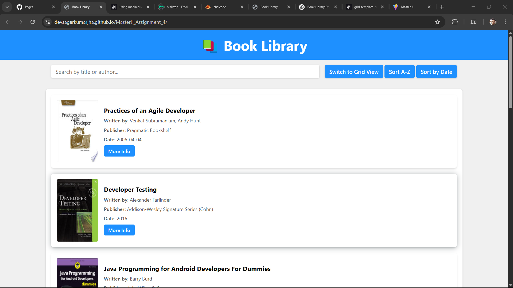
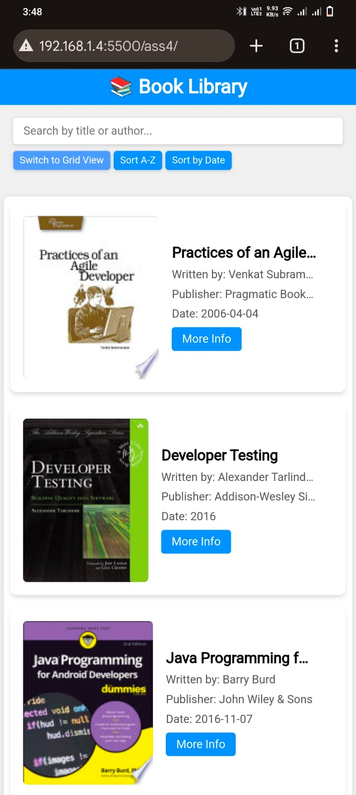
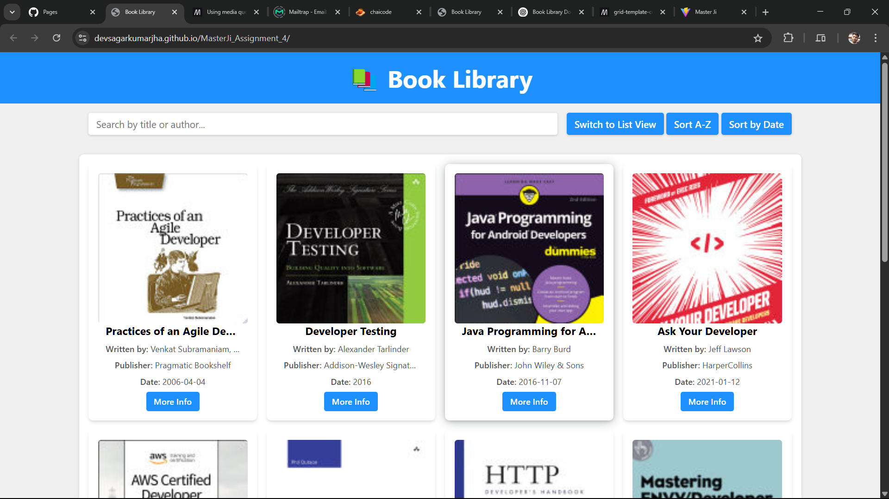
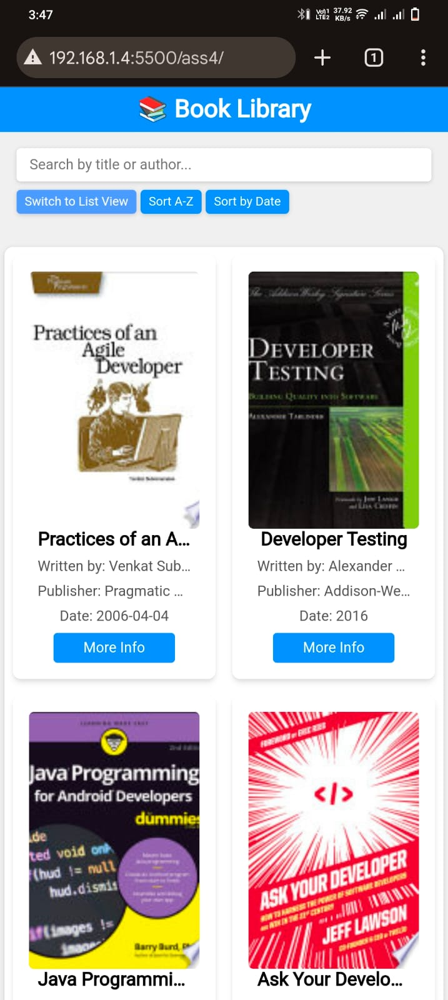

# 📚 Book Library

## Overview

Book Library is a simple web application that allows users to browse, search, and filter books from an external API. The application supports both **list view** and **grid view**, along with sorting and pagination features.

## Features

- 📖 Fetches book data from an API.
- 🔍 Search functionality by title or author.
- 🔄 Toggle between **list view** and **grid view**.
- 🔠 Sort books alphabetically or by publication date.
- 📑 Pagination support for browsing books.

## Project Structure

``` bash
📂 book-library
│── 📄 index.html         # Main HTML file
│── 📄 script.js          # JavaScript logic
│── 📄 style.css          # Stylesheet
│── 📂 assets/images      # Placeholder image for books
```

## Installation & Usage

1. **Clone the repository**

   ```sh
   git clone https://github.com/DevSagarKumarJha/MasterJi_Assignment_4.git
   cd book-library
   ```

2. **Open `index.html` in a browser**.

## Technologies Used

- HTML5
- CSS3
- JavaScript (ES6)
- Free API (`https://api.freeapi.app/api/v1/public/books`)

## File Details

### 1. `index.html`

The main structure of the webpage with:

- A **search bar** for filtering books.
- **Buttons** for sorting and toggling views.
- **Pagination controls** for navigation.
- **Code:**

  ```html
    <!DOCTYPE html>
    <html lang="en">
    <head>
        <meta charset="UTF-8">
        <meta name="viewport" content="width=device-width, initial-scale=1.0">
        <title>Book Library</title>
        <link rel="stylesheet" href="style.css">
    </head>
    <body>

        <h1 class="heading">📚 Book Library</h1>

        <div class="controls">
            <input type="text" id="searchBar" placeholder="Search by title or author...">

            <div class="btns">
                <button id="toggleView">Switch to Grid View</button>
                <button id="sortAlpha">Sort A-Z</button>
                <button id="sortDate">Sort by Date</button>
            </div>
            
        </div>

        <div id="bookContainer" class="list-view"></div>

        <div class="pagination">
            <button id="prevPage" disabled>Previous</button>
            <span id="pageInfo">Page 1</span>
            <button id="nextPage">Next</button>
        </div>

        <script src="script.js"></script>

    </body>
    </html>
  ```

### 2. `script.js`

Handles all JavaScript functionalities:

- Fetching books from the API.
- Searching, sorting, and filtering books.
- Toggling between list and grid views.
- Managing pagination.
- **Code:**

  ```js
    const API_URL = "https://api.freeapi.app/api/v1/public/books";
    let books = [];
    let currentPage = 1;
    let totalPages = 1;
    let isGridView = false;


    // Fetch Books
    async function fetchBooks(page = 1) {
        try {
            const res = await fetch(`${API_URL}?page=${page}`);
            const responseData = await res.json();
            books = responseData.data.data;
            totalPages = responseData.data.totalPages;

            console.log(books)
            updatePagination();
            displayBooks(books);
        } catch (error) {
            console.error("Error fetching books:", error);
        }
    }

    // Display Books
    function displayBooks(bookList) {
        const container = document.getElementById("bookContainer");
        container.innerHTML = "";
        container.className = isGridView ? "grid-view" : "list-view";

        console.log(container.className)
        bookList.forEach(book => {
            const { title, authors, publisher, publishedDate, imageLinks, infoLink } = book.volumeInfo;
            const thumbnail = imageLinks?.thumbnail || "./assets/images/placeholder.png";

            const bookDiv = document.createElement("div");
            bookDiv.className = "book";
            bookDiv.innerHTML = `
                
                <div>
                    <h3>${title}</h3>
                    <p><span>Written by:</span> ${authors ? authors.join(", ") : "Unknown"}</p>
                    <p><span>Publisher:</span> ${publisher || "Unknown"}</p>
                    <p><span>Date:</span> ${publishedDate || "N/A"}</p>
                    <a href="${infoLink}" target="_blank">More Info</a>
                </div>
            `;
            container.appendChild(bookDiv);
        });
    }

    // Update Pagination Buttons
    function updatePagination() {
        document.getElementById("pageInfo").textContent = `Page ${currentPage} of ${totalPages}`;
        document.getElementById("prevPage").disabled = currentPage === 1;
        document.getElementById("nextPage").disabled = currentPage === totalPages;
    }

    // Search Books
    document.getElementById("searchBar").addEventListener("input", (e) => {
        const query = e.target.value.toLowerCase();
        const filteredBooks = books.filter(book =>
            book.volumeInfo.title.toLowerCase().includes(query) ||
            (book.volumeInfo.authors && book.volumeInfo.authors.some(author => author.toLowerCase().includes(query)))
        );
        displayBooks(filteredBooks);
    });

    // Toggle View
    document.getElementById("toggleView").addEventListener("click", () => {
        isGridView = !isGridView;
        document.getElementById("toggleView").textContent = isGridView ? "Switch to List View" : "Switch to Grid View";
        displayBooks(books);
    });

    // Sort Books
    document.getElementById("sortAlpha").addEventListener("click", () => {
        books.sort((a, b) => a.volumeInfo.title.localeCompare(b.volumeInfo.title));
        displayBooks(books);
    });
    document.getElementById("sortDate").addEventListener("click", () => {
        books.sort((a, b) => new Date(b.volumeInfo.publishedDate) - new Date(a.volumeInfo.publishedDate));
        displayBooks(books);
    });

    // Pagination Controls
    document.getElementById("prevPage").addEventListener("click", () => {
        if (currentPage > 1) {
            currentPage--;
            fetchBooks(currentPage);
        }
    });

    document.getElementById("nextPage").addEventListener("click", () => {
        if (currentPage < totalPages) {
            currentPage++;
            fetchBooks(currentPage);
        }
    });

    // Load Books on Page Load
    fetchBooks();

  ```

### 3. `style.css`

Defines the UI styling:

- **Responsive design** for mobile, tablet, and desktop.
- **Grid and list layouts** for book display.
- **Interactive buttons** with hover effects.
- **Code:**

  ```css
        /* Global Styles */
    * {
        padding: 0;
        margin: 0;
        box-sizing: border-box;
        font-family: system-ui, -apple-system, BlinkMacSystemFont, 'Segoe UI', Roboto, Oxygen, Ubuntu, Cantarell, 'Open Sans', 'Helvetica Neue', sans-serif;
    }

    body {
        background-color: #f0f0f0;
    }

    /* Heading */
    .heading {
        text-align: center;
        background-color: #1e90ff;
        color: white;
        font-size: 40px;
        padding: 1rem;
    }

    /* Controls (Search, View Toggle, Sorting) */
    .controls {
        width: 90%;
        max-width: 1200px;
        display: flex;
        flex-wrap: wrap;
        justify-content: center;
        align-items: center;
        margin: auto;
        padding: 1rem;
        gap: 1rem;
    }

    input[type="text"] {
        flex: 1;
        min-width: 250px;
        padding: 0.5rem 0.8rem;
        border: none;
        border-radius: 0.25rem;
        font-size: 16px;
        box-shadow: rgba(0, 0, 0, 0.16) 0px 1px 4px;
    }

    button {
        background-color: #1e90ff;
        color: white;
        padding: 0.5rem 0.8rem;
        font-size: 16px;
        font-weight: 600;
        border: none;
        border-radius: 0.25rem;
        cursor: pointer;
        box-shadow: rgba(0, 0, 0, 0.16) 0px 1px 4px;
    }

    button:hover {
        background-color: #5e9aff;
    }

    /* Book Container */
    #bookContainer {
        background-color: #fff;
        width: 90%;
        max-width: 1200px;
        margin: 1rem auto;
        padding: 1rem;
        border-radius: 0.5rem;
        box-shadow: rgba(0, 0, 0, 0.16) 0px 1px 4px;
    }

    /* Common Book Styles */
    .book {
        padding: 1rem;
        border-radius: 0.5rem;
        box-shadow: rgba(0, 0, 0, 0.1) 0px 4px 6px -1px, rgba(0, 0, 0, 0.06) 0px 2px 4px -1px;
        transition: 0.3s;
    }

    .book:hover {
        box-shadow: rgba(14, 30, 37, 0.12) 0px 2px 4px 0px, rgba(14, 30, 37, 0.32) 0px 2px 16px 0px;
    }

    /* List View */
    .list-view {
        display: flex;
        flex-direction: column;
        gap: 1rem;
    }

    .list-view .book {
        display: flex;
        flex-direction: row;
        align-items: center;
        gap: 1rem;
    }

    .list-view .book img {
        width: 120px;
        height: 180px;
        border-radius: 5px;
    }

    /* Grid View */
    .grid-view {
        display: grid;
        grid-template-columns: repeat(auto-fit, minmax(250px, 1fr));
        gap: 1rem;
    }

    .grid-view .book {
        display: flex;
        flex-direction: column;
        align-items: center;
        text-align: center;
        padding: 1rem;
    }

    .grid-view .book img {
        width: 100%;
        height: 250px;
        object-fit: cover;
        object-position: top;
        border-radius: 5px;
    }

    /* Ellipsis for Overflowing Text */
    .book div {
        width: 100%;
        display: flex;
        flex-direction: column;
        align-items: flex-start;
        gap: 0.5rem;
        overflow: hidden;
    }

    .grid-view .book div {
        align-items: center;
    }

    .book div h3,
    .book div p {
        width: 100%;
        white-space: nowrap;
        overflow: hidden;
        text-overflow: ellipsis;
    }

    .book div h3 {
        font-size: 18px;
        font-weight: bold;
        max-width: 90%;
    }

    .book div p {
        font-size: 14px;
        max-width: 90%;
        color: #555;
    }

    .book div p span {
        font-weight: 500;
    }

    .book div a {
        font-size: 14px;
        text-decoration: none;
        background-color: #1e90ff;
        color: #fff;
        font-weight: 600;
        padding: 0.4rem 0.8rem;
        border-radius: 0.25rem;
        white-space: nowrap;
    }

    .book div a:hover {
        background-color: #5e9aff;
    }

    /* Pagination */
    .pagination {
        display: flex;
        align-items: center;
        justify-content: center;
        gap: 2rem;
        margin: 1rem 0;
    }

    /* Responsive Design */

    /* Tablets */
    @media (max-width: 1024px) {
        .heading {
            font-size: 36px;
        }

        .controls {
            flex-direction: column;
            align-items: stretch;
            gap:1rem;
        }

        .list-view .book img {
            width: 100px;
            height: 150px;
        }

        .grid-view {
            grid-template-columns: repeat(auto-fit, minmax(230px, 1fr));
        }
    }

    /* Mobile Devices */
    @media (max-width: 768px) {
        .heading {
            font-size: 30px;
        }

        .controls {
            width: 100%;
        }

        input[type="text"] {
            width: 100%;
            font-size: 14px;
        }

        button {
            font-size: 14px;
            padding: 0.4rem 0.6rem;
        }

        #bookContainer {
            width: 95%;
            padding: 1rem;
        }

        .list-view .book img {
            width: 180px;
            height: 220px;
        }

        .grid-view {
            grid-template-columns: repeat(auto-fit, minmax(200px, 1fr));
        }
    }

    /* Small Mobile Screens */
    @media (max-width: 480px) {
        .heading {
            font-size: 24px;
            padding: 0.5rem;
        }

        .controls {
            flex-direction: column;
            gap: 0.5rem;
        }

        button {
            font-size: 12px;
            padding: 0.3rem 0.5rem;
        }

        #bookContainer {
            width: 98%;
            padding: 0.5rem;
        }

        .list-view .book img {
            width: 170px;
            height: 200px;
        }

        .grid-view {
            grid-template-columns: repeat(auto-fit, minmax(130px, 1fr));
        }
    }
    ```

## How It Works

1. The application fetches books from the API when loaded.
2. Users can search for books using the search bar.
3. The view can be toggled between list and grid.
4. Books can be sorted by title (A-Z) or by date.
5. Pagination buttons allow users to navigate through pages.

## Screenshots

### List view image

- Desktop



- Mobile



### Grid view image

- Desktop



- Mobile
  


## Future Improvements

- ✅ Add a **favorites** feature.
- ✅ Implement a **dark mode**.
- ✅ Allow users to add **custom books**.

## Deployment Link

- [Click here](https://devsagarkumarjha.github.io/MasterJi_Assignment_4/) to visit the demo.
